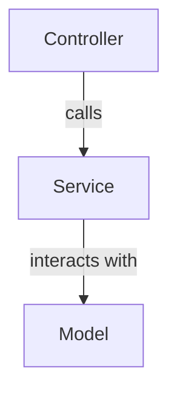

# PHP MVC
# Simple PHP API MVC Template

This is a simple PHP API MVC template.

## Getting Started

> Note: The following mermaid diagram may not render in all markdown viewers.




To get started with this template, follow these steps:

1. Clone the repository:
    ```bash
    git clone https://github.com/hheinsoee/mvc_php.git
    ```
2. Navigate to the project directory:
    ```bash
    cd mvc_php
    ```
3. Install dependencies:
    ```bash
    composer install
    ```
4. Configure your environment settings in the `.env` file.

## Usage

To start the development server, run:
```bash
php -S localhost:8000 -t public
```

## Contributing

Feel free to submit issues or pull requests.

## License

This project is licensed under the MIT License.
